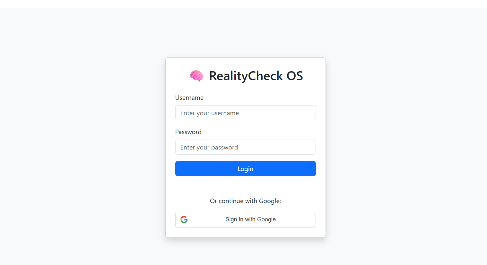
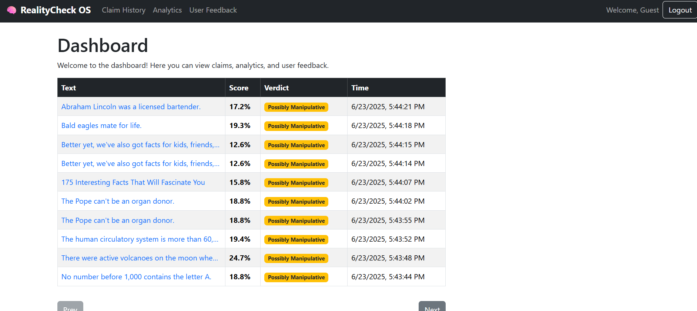
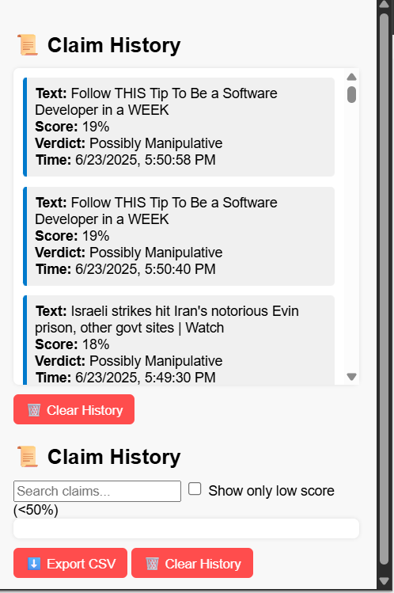
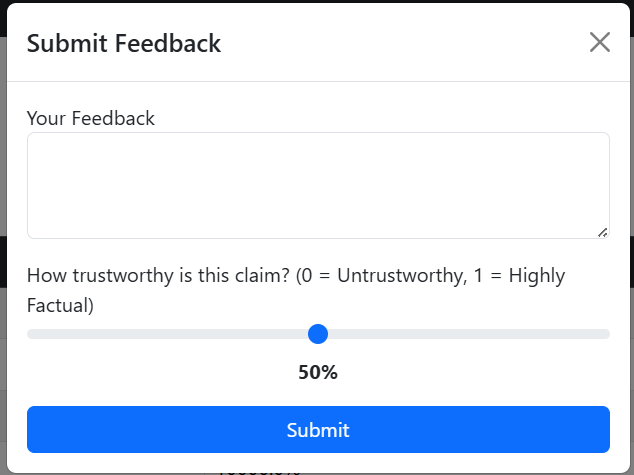

# 🧠 RealityCheck OS

**A real-time fact assessment system that detects manipulative or misleading content across the web.**







---

## 🚀 Overview

RealityCheck OS is a full-stack application designed to combat misinformation by analyzing text for factual accuracy and manipulation signals using Machine Learning and NLP.

It features:

- 🔐 Secure login with JWT and Google OAuth
- 📊 ML-powered claim scoring
- ✨ Browser extension for real-time analysis
- 📈 Interactive analytics dashboard
- 📋 Feedback and rating system for human-in-the-loop validation

---

## 🛠️ Tech Stack

### 🧩 Frontend
- **ReactJS** with Bootstrap
- **Chart.js** for data visualization
- **Redux (optional)** for state management

### 🔙 Backend
- **Django + Django REST Framework**
- **SQLite/MySQL** (configurable)
- **Rate Limiting** via `django-ratelimit`
- **ML Integration** using `scikit-learn` & `spaCy`

---

## 📦 Features

### 🔎 Real-Time Claim Analysis
Paste or highlight text anywhere on the web to receive:
- A score between 0 and 1
- Verdict: ✅ *Factual* or ⚠️ *Possibly Manipulative*
- NLP insights (clickbait detection, passive voice, etc.)

### 📊 Analytics Dashboard
Track score distribution across uploaded claims:


### 💬 User Feedback Collection
Users can submit trust ratings for claims:


### 🌐 Chrome Extension Support
Highlight text on any website to trigger a floating verdict popup:


---

## 🧠 ML Model

### Training
- Trained on ~10k cleaned records (Kaggle + Fact-based datasets)
- Logistic Regression on top of `TfidfVectorizer`
- Boosted with rule-based NLP adjustments (adjectives, numerics, passive voice)

### Files:
- `vectorizer.pkl`
- `veracity_model.pkl`
- `nlp_score.py`

---

## 🔐 Authentication

- JWT-based authentication
- Google Sign-In via OAuth2 (Django)
- Protected routes on frontend

---

## 📁 Project Structure

reality-check-os/
├── backend/
│ ├── api/
│ │ ├── views.py
│ │ ├── ml/ (vectorizer, model, NLP scorer)
│ │ └── urls.py
│ ├── settings.py
│ └── ...
├── frontend/
│ ├── components/
│ │ ├── Dashboard.jsx
│ │ ├── FeedbackTable.jsx
│ │ ├── Analytics.jsx
│ │ └── ...
│ └── App.js
├── extension/
│ ├── content.js
│ └── manifest.json
├── dataset/ (not included in repo)
└── README.md


---

## 🧪 Usage

### 1. Clone Repo

```bash
git clone https://github.com/rkdevx/reality-check-os.git
cd reality-check-os
2. Backend Setup
bash
Copy
Edit
cd backend
pip install -r requirements.txt
python manage.py migrate
python manage.py runserver
3. Frontend Setup
bash
Copy
Edit
cd frontend
npm install
npm start
4. (Optional) Chrome Extension
Go to chrome://extensions

Enable "Developer Mode"

Click "Load Unpacked"

Select the extension/ folder


✅ TODOs
 JWT & Google Login

 Claim logging and verdicting

 User feedback modal

 Interactive analytics

 Chrome extension

 Model retraining pipeline

 Admin panel with logs

👨‍💻 Author
Made with ❤️ by Radhakrishan
